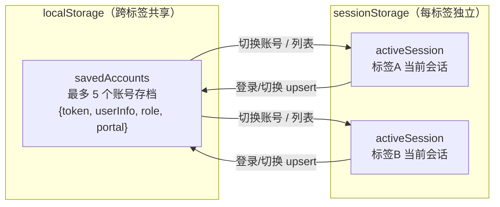

# 2026-09-10 全量更新汇总

> 版本：v1.0 ｜ 日期：2026-09-10 ｜ 适用范围：课程管理实施平台全端
> 仓库：https://github.com/T-an-H/first-ancient.git ｜ 分支：main

---

## 总览

本次更新共 **25 次提交**、**35 个文件**、新增 4438 行、删除 553 行，全部已推送至 `origin/main`。

| 时间 | 提交 | 说明 |
|---|---|---|
| 10:34 | `687f34b` | refactor(account): 账号入库制 第1-3步 封漏洞+入库闭环+登录闭环 |
| 10:42 | `f07a2a3` | refactor(account): 第4步 教师选库+全量鉴权 |
| 11:25 | `77ff208` | feat: 第5-6步治理完善+迁移脚本+导出/模板/改密/忘记密码 |
| 11:32 | `6148512` | fix: requireAdmin 补验 GET 请求的 JWT，修复导出接口 401 |
| 12:44 | `f5c0301` | feat: 账号管理页加"添加账号"按钮，管理员可选身份单个入库 |
| 13:12 | `009fb84` | refactor: 管理员"班级管理"改为"学生管理"，平铺列表+编辑删除弹窗 |
| 13:42 | `aa48014` | feat: 导入模板角色改身份列，支持下拉选择中文身份批量导入 |
| 13:52 | `6d6cb33` | feat: 学生/教师管理加批量添加+模板下载，账号管理加删除账号功能 |
| 14:03 | `b95d8d2` | fix: 账号管理导入模板去掉班级列，后续再分配 |
| 14:08 | `c1d26b4` | fix: 学生管理模板去掉班级列，后续再分配 |
| 14:14 | `aab7d7a` | fix: 教师入库同步 phone/department 到 teachers 表，查询 JOIN users 兜底 |
| 14:21 | `5fe93ea` | fix: 教师查询 JOIN users 改用 CONCAT 避免 collation 冲突 |
| 14:30 | `656a8d9` | docs: 新增账号管理功能更新记录文档 |
| 14:40 | `0b30dc1` | feat: 新增账号数据修复脚本，手机号改11位+自动生成学工号+同步表 |
| 14:53 | `a0a5659` | feat: 重置所有密码为666666，导出学生教师表加初始密码列 |
| 15:03 | `8be2a74` | fix: 导出初始密码改为解密身份证取后6位，不再硬编码666666 |
| 15:09 | `92be78b` | fix: 导出始终显示初始密码(身份证后6位)，不再显示已修改 |
| 15:14 | `3143ffb` | feat: 新增脚本给老账号补随机身份证号 |
| 15:16 | `3919297` | fix: fix syntax error in fill_idcard.js |
| 15:22 | `a01b1cd` | feat: 账号管理页加初始密码列，实时显示身份证后6位 |
| 15:43 | `3f55bf5` | feat: 给所有用户端加个人中心，支持修改密码和修改绑定手机号 |
| 16:31 | `5354fe2` | feat: 个人中心重构 + 多账号多窗口会话隔离 |
| 16:42 | `66035b3` | fix: 首登强制改密接口鉴权失败(未登录/登录已过期) |
| 16:48 | `8a260d4` | feat: switch-account page -> account management |

---

## 一、账号入库制重构

**提交：** `687f34b` `f07a2a3` `77ff208` `6148512`

- **第1-3步**：封堵原有入库漏洞，打通"入库 → 登录"全链路闭环，账号入库后即可用初始密码登录。
- **第4步**：教师选学院入库；所有后端接口加全量 JWT 鉴权（`requireAdmin`）。
- **第5-6步**：治理完善，附数据库迁移脚本；补导出/模板/改密/忘记密码入口。
- **导出 401 修复**：`requireAdmin` 补验 GET 请求的 JWT，导出接口不再被拦截。

**涉及文件：** `server/routes/accounts.js`、`server/lib/admin.js`、`server/routes/teachers.js`、`server/routes/students.js`、`server/bootstrap/ensureAdminSchema.js`、`src/api/index.ts`、`src/pages/admin/Accounts.vue`

---

## 二、管理员端账号与身份管理

**提交：** `f5c0301` `009fb84`

- **账号管理页加「添加账号」按钮**：管理员可选择身份（学生/教师/企业导师/学院领导）单个入库。
- **「班级管理」改为「学生管理」**：平铺列表 + 编辑/删除弹窗，交互对齐教师管理端。

**涉及文件：** `src/pages/admin/Accounts.vue`、`src/pages/admin/Students.vue`、`src/components/Sidebar.vue`、`src/router/index.ts`

---

## 三、导入模板与批量添加

**提交：** `aa48014` `6d6cb33` `b95d8d2` `c1d26b4`

- **导入模板「角色」改「身份」列**：支持下拉选中文身份（学生/教师/企业导师/学院领导）批量导入。
- **学生/教师管理加批量添加 + 模板下载**；账号管理加删除账号功能（`DELETE /api/accounts/:id`）。
- **模板去掉「班级」列**：账号管理与学生管理模板均移除班级，改为入库后再分配班级。

**涉及文件：** `src/pages/admin/Accounts.vue`、`src/pages/admin/Students.vue`、`src/pages/admin/Teachers.vue`、`src/api/index.ts`、`server/routes/accounts.js`

---

## 四、教师入库信息同步

**提交：** `aab7d7a` `5fe93ea`

- **入库同步**：教师入库时 phone/department 同步写入 `teachers` 表，查询 JOIN `users` 兜底显示电话。
- **collation 冲突修复**：教师查询 JOIN 改用 `CONCAT` 避免 MySQL collation 冲突，JS 层兜底 phone/department。

**涉及文件：** `server/routes/accounts.js`、`server/routes/teachers.js`、`server/lib/admin.js`

---

## 五、账号数据修复与密码体系

**提交：** `656a8d9` `0b30dc1` `a0a5659` `8be2a74` `92be78b` `3143ffb` `3919297` `a01b1cd`

- **更新记录文档**：新增 `docs/账号管理功能更新记录.md`。
- **账号数据修复脚本**：手机号统一改 11 位、自动生成学工号、同步 `students`/`teachers` 表。
- **密码重置为 666666**：导出学生/教师表加初始密码列。
- **初始密码改为身份证后 6 位**：导出表解密身份证取后 6 位，不再硬编码 666666；始终显示初始密码而非已修改后的密码。
- **老账号补随机身份证号**脚本（含语法修复 `fill_idcard.js`）。
- **账号管理页加初始密码列**：实时显示身份证后 6 位。

**涉及文件：** `server/sql/` 下多个脚本、`server/routes/accounts.js`、`src/pages/admin/Accounts.vue`、`docs/账号管理功能更新记录.md`

---

## 六、个人中心 + 多账号多窗口

**提交：** `3f55bf5` `5354fe2` `66035b3` `8a260d4`

### 6.1 统一个人中心页

- 所有角色（含学生）共用一个「个人中心」页：头像上传、基本信息、「账号与安全」入口（点进去才是修改密码 + 修改手机号）、切换账号、退出登录。
- 侧边栏去掉「修改密码」「退出登录」按钮；学生菜单「个人画像」改「个人中心」。
- 修改密码/手机号后库数据同步更新。
- 后端新增 `avatar` 列与 `POST /user/avatar` 接口，`GET /user/profile` 返回 avatar。

### 6.2 多账号多窗口会话隔离

存储层由单一 `localStorage` 改为双层模型：

- **多窗口互不干扰**：标签 A 登录账号 X，新开标签 B 登录账号 Y，A 仍为 X；刷新各自保留。
- **切换账号保留数据**：最多 5 个账号存档，切换后可免密切回。
- **退出登录**：仅结束当前标签会话，账号仍留在存档可被切回。

### 6.3 首登强制改密修复

- 首登改密成功后直接进主页，不再退回登录页（补调 `store.login()` 正式建立会话）。
- 修复改密接口鉴权失败：token 改写入 `sessionStorage.activeSession`，解决「未登录/登录已过期」。

### 6.4 账号管理（切换账号页升级）

- 列出全部已登录账号（含当前标记 + 头像），显示容量 `x/5`。
- 「添加账号」按钮：新开标签页到登录界面，当前会话不受影响。
- 每个账号可「切换」/「删除」，删除前确认。

**涉及文件：** `src/stores/app.ts`、`src/api/index.ts`、`src/api/knowledgeGraph.ts`、`src/components/Sidebar.vue`、`src/router/index.ts`、`src/pages/Profile.vue`、`src/pages/ChangePassword.vue`、`src/pages/Login.vue`、`src/lib/studentSession.ts`、`server/routes/user.js`、`server/bootstrap/ensureAdminSchema.js`

---

## 涉及文件总表

| 功能线 | 关键文件 | 改动摘要 |
|---|---|---|
| 入库重构 | `server/routes/accounts.js`、`server/lib/admin.js` | 入库闭环、全量鉴权、身份映射、删除端点 |
| 身份管理 | `src/pages/admin/Accounts.vue`、`Students.vue` | 添加账号选身份、班级管理改学生管理 |
| 批量导入 | `Accounts.vue`、`Students.vue`、`Teachers.vue` | 模板改身份列、批量添加、去班级列 |
| 教师同步 | `server/routes/teachers.js` | JOIN users 兜底、CONCAT 修 collation |
| 密码体系 | `server/sql/*`、`Accounts.vue` | 数据修复、初始密码=身份证后6位、密码列 |
| 个人中心 | `src/pages/Profile.vue`、`src/stores/app.ts` | 统一个人中心、双层存储、多窗口隔离 |
| 个人中心 | `src/pages/Login.vue`、`ChangePassword.vue` | 首登改密直进主页、token 写 sessionStorage |
| 个人中心 | `server/routes/user.js`、`ensureAdminSchema.js` | avatar 列、POST /user/avatar |

---

## 部署与验证

- 全部 25 次提交已推送至 `origin/main`（`https://github.com/T-an-H/first-ancient.git`）。
- 服务器需执行一次表结构迁移（`ensureAdminSchema` 自动补 `avatar` 等列）。

**验证点：**

1. 管理员可按身份单个/批量入库，导入模板身份列为中文下拉。
2. 学生/教师管理可批量添加并下载模板，模板无班级列。
3. 教师入库后电话/学院在管理端正确显示。
4. 账号管理页显示初始密码（身份证后 6 位），导出表密码列一致。
5. 各角色侧边栏无修改密码/退出登录按钮，菜单显示「个人中心」。
6. 个人中心含头像、基本信息、账号与安全（改密/改手机号）、账号管理、退出登录。
7. 首登强制改密成功后直接进主页。
8. 标签 A 登录 X，新开标签 B 登录 Y，互不干扰；刷新各自保留。
9. 切换账号列表最多 5 个，可添加/删除/切换，切换后数据保留可切回。
10. 头像上传后在个人中心显示。

---

## 技术栈

- **前端**：Vue 3.5 + TypeScript 5.8 + Vite 6 + Vue Router 4 + Pinia 3 + TailwindCSS 3 + D3 7（侧边栏渲染）+ ECharts 6（图表）+ xlsx 0.18（Excel 导入导出）+ lucide-vue-next（图标）
- **后端**：Node.js + Express + MySQL2（MySQL 驱动）+ jsonwebtoken（JWT 鉴权）+ bcryptjs（密码哈希）+ cors + zod + @langchain/langgraph + @langchain/openai（AI 助手）
- **数据存储**：MySQL（业务库）+ 浏览器 sessionStorage（每标签会话）+ localStorage（账号存档/业务缓存）
- **构建/校验**：vue-tsc + vite build

---

## 改动代码清单（33 文件）

| 目录 | 文件 | 改动摘要 |
|---|---|---|
| docs/ | deployment-guide.md | 部署指南更新 |
| docs/ | 账号入库制重构方案.md | 入库重构方案文档 |
| docs/ | 账号管理功能更新记录.md | 账号管理更新记录文档 |
| docs/ | _upload_check.png | 上传校验截图 |
| server/bootstrap/ | ensureAdminSchema.js | 自动补 avatar 等列 |
| server/lib/ | admin.js | 鉴权/入库工具，JOIN users 兜底 |
| server/lib/ | crypto.js | 身份证加解密工具 |
| server/lib/ | jwt-secret.js | JWT 密钥 |
| server/middleware/ | auth.js | requireAdmin 全量鉴权 |
| server/routes/ | accounts.js | 入库闭环、身份映射、删除端点、教师同步 |
| server/routes/ | auth.js | 登录鉴权 |
| server/routes/ | teachers.js | 查询 JOIN users、CONCAT 修 collation |
| server/routes/ | teaching.js | 教学接口鉴权 |
| server/routes/ | user.js | 改密/改手机号/profile/avatar 接口 |
| server/sql/ | fill_idcard.js | 老账号补随机身份证号 |
| server/sql/ | fix_account_data.js | 手机号改11位+自动学工号+同步表 |
| server/sql/ | migrate_accounts.js | 账号迁移脚本 |
| server/sql/ | reset_passwords.js | 重置密码脚本 |
| server/ | index.js | 服务入口/路由挂载 |
| src/api/ | index.ts | token 注入改 sessionStorage、uploadAvatar、deleteAccount |
| src/api/ | knowledgeGraph.ts | token 注入改 sessionStorage |
| src/components/ | Sidebar.vue | 去底部按钮、学生菜单改「个人中心」 |
| src/lib/ | studentSession.ts | 读 sessionStorage.activeSession |
| src/pages/ | ChangePassword.vue | 首登改密后调 store.login 进主页 |
| src/pages/ | ChangePasswordInApp.vue | 应用内改密页 |
| src/pages/ | Login.vue | completeLogin 适配双层存储、首登写 sessionStorage |
| src/pages/ | Profile.vue | 统一个人中心：头像/基本信息/账号与安全/账号管理/退出 |
| src/pages/admin/ | Accounts.vue | 添加账号选身份、模板改身份列、删除账号、密码列 |
| src/pages/admin/ | Students.vue | 班级管理改学生管理、批量添加、模板下载 |
| src/pages/admin/ | Teachers.vue | 批量添加、模板下载、电话同步 |
| src/pages/teacher/ | CourseDetail.vue | 教师课程详情 |
| src/pages/teacher/ | Courses.vue | 教师课程列表 |
| src/router/ | index.ts | StudentProfile 改指统一 Profile.vue |
| src/stores/ | app.ts | 双层存储、login/logout/switchAccount/账号存档 |
| src/utils/ | d3-renderer.ts | D3 渲染工具 |
