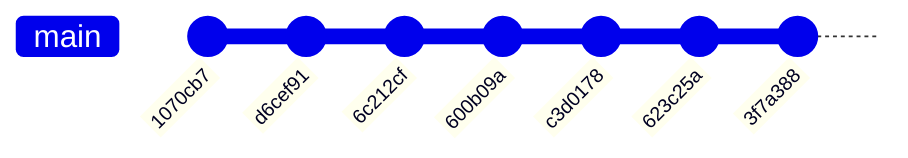
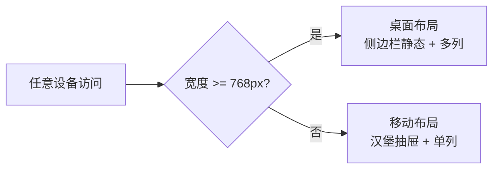
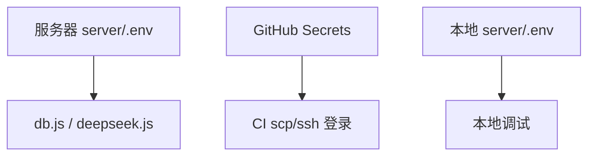
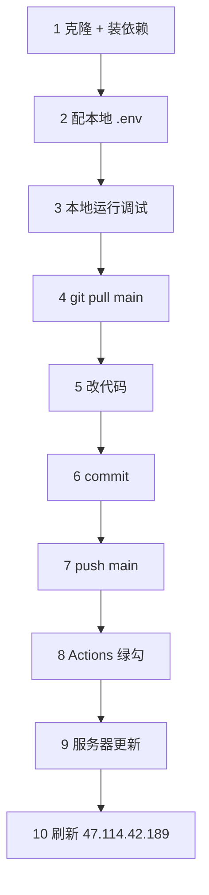
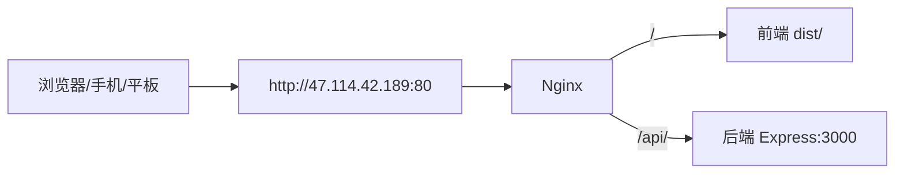

# 更新内容与协作同步教程

> 本文档分两部分：一是本次部署调试期间对代码/配置的具体更新内容；
> 二是共创者（后续合作人）在自己电脑上拉取、开发、推送代码并正确触发服务器同步的完整教程。
> 仓库地址：https://github.com/T-an-H/first-ancient.git

---

# 第一部分 · 本次更新具体内容

## 1. CI 工作流 `.github/workflows/deploy.yml`（核心改动）

从初版到跑通，共 7 个部署相关提交，在 `main` 上依次排雷：



| 提交 | 改动 | 解决的问题 |
|------|------|------|
| `1070cb7` | 初版工作流 + 文档 | 用 rsync-action 传文件 |
| `d6cef91` | 改用 tar+scp+ssh | rsync-action 网络不稳 |
| `6c212cf` | 跳过 vue-tsc，直接 vite build | vue-tsc 类型检查报错阻塞构建 |
| `600b09a` | tar 打包命令单行 + ls 校验 dist | 打包命令换行被 shell 拆断 |
| `c3d0178` | scp source/target 路径修复 | `tar: empty archive` |
| `623c25a` | pm2 用绝对路径调用 | `pm2: command not found` |
| `3f7a388` | 文档记录踩坑与验证 | 复盘 |

### 1.1 构建步骤
- 改为 `VITE_API_BASE=/api npx vite build`，跳过 `vue-tsc -b` 类型检查（仓库有历史类型错误，会阻塞 CI）。
- 用 `VITE_API_BASE=/api` 让前端请求走 Nginx 同源代理。

### 1.2 打包步骤
- `ls -la dist/index.html server/index.js` 先校验产物存在，不存在立即失败。
- `tar --exclude='server/node_modules' --exclude='server/.env' -czf deploy.tar.gz dist server`，把包放在 **workspace 根目录**（不是 `/tmp`）。

### 1.3 scp 步骤（修复 `tar: empty archive`）
- **根因**：`scp-action` 在 Docker 容器内执行，容器只挂了 workspace（`/github/workspace`），没挂宿主机 `/tmp`。原来 `source: "/tmp/deploy.tar.gz"` 在容器里找不到 → glob 匹配为空 → drone-scp 打空包。`target` 还误写成文件路径而非目录。
- **修复**：`source: "deploy.tar.gz"`（相对 workspace）；`target: "/tmp"`（远端目录）。文件落到 `/tmp/deploy.tar.gz`，对上后面 ssh 解压。

### 1.4 ssh 步骤（修复 `pm2: command not found`）
- **根因**：`ssh-action` 跑非交互式 shell，不加载 `.bashrc`/`.profile`，pm2 全局 bin 不在 `PATH`。
- **修复**：用 `PM2_BIN="$(npm config get prefix)/bin/pm2"` 拿绝对路径调用；pm2 未装则 `npm install -g pm2`；加 `set -e` 快速失败。
- 解压前备份 `server/.env`，解压后还原（tar 排除了 `.env`，不会覆盖服务器真实配置）。

## 2. `.gitignore`
- 新增 `deploy.tar.gz`，防止本地误生成的 tar 包被提交。

## 3. 移动端适配（前端响应式）

基于 Tailwind 断点（sm 640 / md 768 / lg 1024 / xl 1280），以 `md:` 为桌面分界，共 **22 个 `.vue` 文件**使用响应式类。一套代码同时适配桌面与移动，无独立移动端代码库。



- **`index.html`**：`<meta name="viewport" content="width=device-width, initial-scale=1.0">` 已设置，移动端不会被缩放成桌面宽度。
- **`src/components/Layout.vue`**：移动端顶部栏（`md:hidden`，含汉堡按钮）；侧边栏桌面静态、移动端抽屉（`translate-x` 切换）+ 遮罩层；主内容区 `pt-12 md:pt-0` 给移动顶栏留位；路由切换自动关闭移动抽屉。
- **`src/components/AgentChat.vue`**：浮动按钮 `fixed bottom-6 right-6`；面板 `w-80 sm:w-96`、`max-h-[70vh]` 自适应高度，移动端不遮挡全屏。
- **各业务页面**：Login、admin/Teachers、teacher/CourseDetail、student/CourseLearn、Profile、Grades 等，用 `md:grid md:flex` 在移动单列、桌面多列间切换。

## 4. 数据库密码与密钥配置

三条密钥链路，互不混淆：



### 4.1 服务器环境变量 `server/.env`（不进仓库，只放服务器）
| 变量 | 用途 | 读取位置 |
|------|------|----------|
| `PORT` | 后端监听端口，默认 3000 | `server/index.js` |
| `DB_PASSWORD` | MySQL root 密码 | `server/db.js`（无则用硬编码 fallback） |
| `DEEPSEEK_API_KEY` | DeepSeek 大模型 API Key | `server/deepseek.js` / `assistant-agent.js` |
| `CORS_ORIGINS` | 额外允许的跨域来源 | `server/index.js`（默认含 localhost:5173/5177） |

### 4.2 硬编码与安全提示
- **DB 密码 fallback**：`server/db.js` 里 `process.env.DB_PASSWORD || 'LZH88888888'`。服务器用 `.env` 强密码覆盖；本地开发可借 fallback 连本机 MySQL。**改密码改 `.env`，别改 `db.js`**。
- **JWT_SECRET 硬编码**：`'course-platform-secret-key-2026'` 写死在 `auth.js` / `user.js` / `routes/auth.js` 三处。建议后续改为读 `process.env.JWT_SECRET` 并在 `.env` 配置（本次未改）。
- **本地 Windows 兜底**：`server/load-env.js` 依次加载 `.env.local` / `.env`（项目根与 server 目录）；若 `DEEPSEEK_API_KEY` 仍缺失，在 Windows 下还会从用户/系统环境变量读取。所以本地调试既可写 `server/.env`，也可设系统环境变量。

### 4.3 GitHub Secrets（CI 部署用，与 `server/.env` 分开）
| Secret | 值 | 用途 |
|--------|-----|------|
| `ALIYUN_HOST` | `47.114.42.189` | 服务器 IP |
| `ALIYUN_USER` | `root` | SSH 用户 |
| `ALIYUN_SSH_KEY` | 部署私钥整段 | scp/ssh 免密登录 |

### 4.4 三条铁律
1. `server/.env` 永远不提交（已在 `.gitignore`）。
2. 服务器上的 `.env` 由 tar 排除，部署不会覆盖，改密码直接在服务器改。
3. 别把真实 DB 密码 / DeepSeek Key 写进代码或提交，一律走 `.env`。

---

# 第二部分 · 共创者后期同步代码教程

> 目标：你在自己电脑上改完代码，push 之后服务器自动更新成最新版。
> 唯一触发部署的条件：**push 到 `main` 分支**。

## 导航图：完整贡献者工作流



## 第 1 步 · 克隆仓库并安装依赖（自己电脑上一次性）

<details><summary>展开命令</summary>

```bash
git clone https://github.com/T-an-H/first-ancient.git
cd first-ancient
npm ci                       # 前端依赖
cd server && npm ci && cd .. # 后端依赖（本地调试才需要）
```
需要 Node 20+。Windows / Mac / Linux 均可。
</details>

## 第 2 步 · 配置本地密钥（本地调试才需要；只改前端可跳过）

在 `server/` 下新建 `.env`，放本地 MySQL 密码与 DeepSeek Key。**此文件已被 `.gitignore` 忽略，不会被上传**：

<details><summary>展开 server/.env 模板</summary>

```bash
# server/.env  （本地用，不提交）
PORT=3000
DB_PASSWORD=你本机MySQL密码
DEEPSEEK_API_KEY=你的DeepSeekKey
CORS_ORIGINS=http://localhost:5173
```
</details>

Windows 下也可不写 `.env`，改用系统环境变量设置 `DEEPSEEK_API_KEY`（`load-env.js` 会自动读取）。

## 第 3 步 · 本地运行

```bash
npm run dev              # 前端，浏览器开 http://localhost:5173
# 另开一个终端：
node server/index.js     # 后端 :3000
```

前端已配置 `/api` 代理到本地 3000，无需手动处理跨域。

## 第 4 步 · 改代码后推送（关键，决定能否自动上线）

<details><summary>展开推送命令</summary>

```bash
git pull origin main          # ① 改之前先拉，避免冲突
# ② 在 Cursor / 编辑器里改代码……
git add .                     # ③ 暂存改动
git commit -m "说明改了啥"     # ④ 提交
git push origin main          # ⑤ 推到 main → 自动触发部署
```
</details>

推送后：
1. 去 GitHub 仓库 → **Actions** 页面，看 "Deploy to Aliyun" 那次运行。
2. 等到**绿勾**，刷新 `http://47.114.42.189` 就是最新版。
3. 如果是红叉，点进去看哪一步失败，把日志发给管理员。

## 第 5 步 · 多人协作：先开发再合并（推荐）

直接推 `main` 适合小改动。多人同时开发建议用分支，避免互相踩：


```bash
git checkout -b feat/我的功能     # 建功能分支
# ……改代码……
git push origin feat/我的功能     # 推到分支，不会触发部署
# 然后在 GitHub 网页发 Pull Request → 评审 → 合并到 main
# 合并到 main 的那一刻，自动部署
```

## 第 6 步 · 必须记住的规则

- **只有 push 到 `main` 才会部署。** 推到 `feat/*` 等其他分支不会上线。
- **不要直接在服务器上改代码。** 下次部署会用 tar 覆盖，你的改动会丢。所有改动都在本地改完 push。
- **不要提交这些文件**（都已在 `.gitignore`，正常 `git add .` 不会加进去，别手动强制加）：
  - `server/.env`（密钥）
  - `node_modules/`（依赖）
  - `dist/`（构建产物）
  - `deploy.tar.gz`（打包临时文件）
- **改之前先 `git pull origin main`**，避免推送时冲突被拒。

## 第 7 步 · 推送了却没上线？排查

1. 确认推的是 `main`：`git branch --show-current` 应输出 `main`。
2. 看 GitHub Actions 页面有没有红叉，红叉点进去看哪步失败。
3. 常见失败原因：
   - **构建报错**：本地先跑 `npm run build` 验证能过再推。
   - **scp/ssh 密钥问题**：找管理员检查 GitHub Secrets（`ALIYUN_HOST` / `ALIYUN_USER` / `ALIYUN_SSH_KEY`）。
   - **推到了非 main 分支**：合并到 main 才会部署。

## 第 8 步 · 如何公网访问系统

部署成功后，任何人在公网上用浏览器就能访问，**不需要 VPN、不需要连内网、不需要装任何客户端**。



### 访问地址
```
http://47.114.42.189
```
- 电脑、手机、平板直接用浏览器打开即可（页面已做响应式适配，手机自动切单列+抽屉菜单）。
- 这是 HTTP 明文地址，浏览器可能提示"不安全"，属正常现象，后续配域名后可一键加 HTTPS。

### 登录账号
系统已内置一批测试账号（由 `server/seed-users.js` 灌入），**所有账号的初始密码均为 `666666`**：

| 角色 | 账号示例 | 说明 |
|------|----------|------|
| 管理员 | `admin` | 后台管理、选学院、管教师/学生 |
| 授课导师 | `teacher-wang`、`teacher-li` … | 教师端，管课程/成绩 |
| 企业导师 | `mentor-zhang`、`mentor-li` | 企业导师视角 |
| 学院领导 | `leader-liu`、`leader-chen` | 院领导视角 |
| 学生 | `S2024001`、`S2024002` … | 学生端，看课程/作业/成绩 |

> 正式使用时请在管理员后台修改密码或新建真实账号，不要长期用初始密码。

### 验证服务是否正常
打开页面后若想确认后端没掉线，在浏览器地址栏或命令行访问健康检查接口：
```bash
curl http://47.114.42.189/api/health
# 正常应返回：{"status":"ok","time":"..."}
```
返回 `status: ok` 即后端正常；若页面能打开但接口报错，多半是后端 pm2 进程挂了，联系管理员 `pm2 restart course-api`。

### 打不开的排查
1. **浏览器一直转圈/超时**：阿里云安全组没放行 80 端口 → 控制台加 80 入方向规则。
2. **能打开但样式错乱**：CDN/缓存问题 → 强制刷新（Ctrl+F5）；或上次部署没跑完，等 Actions 绿勾再试。
3. **页面打开是 Nginx 默认页**：Nginx 配置没生效 → 联系管理员 `nginx -t && systemctl reload nginx`。
4. **接口 502 Bad Gateway**：后端没起 → `pm2 status` 看 course-api 是否 online，挂了就 `pm2 restart course-api`。

---

## 附 · 仓库当前部署相关文件

| 文件 | 作用 |
|------|------|
| `.github/workflows/deploy.yml` | 自动部署工作流（push main 触发） |
| `部署过程.md` | 完整已验证部署过程文档 |
| `更新与协作教程.md` | 本文档 |
| `server/.env`（服务器上，不进仓库） | 数据库密码、API Key 等密钥 |
| `server/db.js` | 数据库连接，读 `DB_PASSWORD` 环境变量 |
