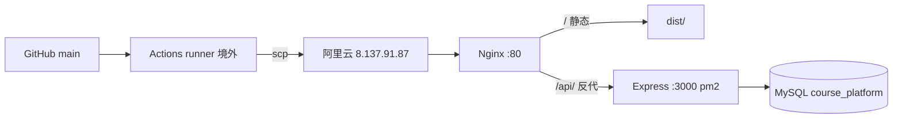
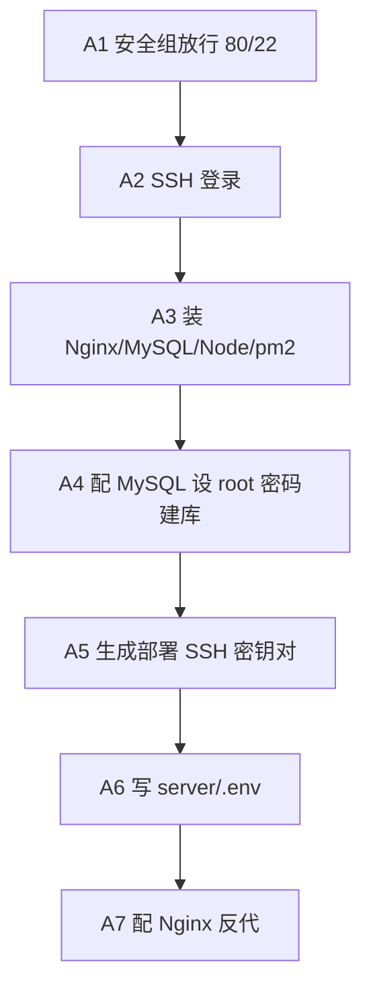
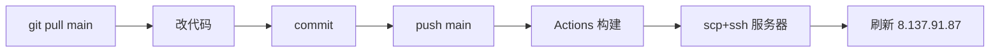

# 部署过程（已验证成功）

> 课程管理实施平台 `first-ancient` → 阿里云 ECS 自动部署全流程。
> 最终状态：push `main` 即自动构建并同步到服务器，线上已验证通过。

## TL;DR

| 项 | 值 |
|----|----|
| 服务器 | 阿里云 ECS `8.137.91.87`（Ubuntu 22.04） |
| 触发方式 | push 到 `main` 分支（或 Actions 手动 Run） |
| 线上状态 | 已验证通过（health 200，首页 200） |
| 验证 commit | `623c25a`（2026-09-08） |
| 访问地址 | http://8.137.91.87 |

---

## 0. 架构总览



- 服务器全程不访问 GitHub，规避大陆网络问题；构建在境外 runner 完成。
- 前端走 Nginx 同源代理，不触发跨域；后端 Express 只监听本地 3000。

---

## 1. 服务器一次性环境（阶段 A，约 20 分钟）



### A1. 安全组放行端口
阿里云控制台 → ECS → 安全组 → 入方向规则：

| 端口 | 来源 | 用途 |
|------|------|------|
| 80 | 0.0.0.0/0 | HTTP 公网访问 |
| 22 | 0.0.0.0/0 | SSH（建议 later 限定为你家 IP） |

### A2. SSH 登录
```bash
ssh root@8.137.91.87
```

### A3. 安装基础软件
<details><summary>展开命令</summary>

```bash
apt update && apt upgrade -y
apt install -y nginx mysql-server
curl -fsSL https://deb.nodesource.com/setup_20.x | bash -
apt install -y nodejs
npm i -g pm2
npm config set registry https://registry.npmmirror.com
```
验证：`node -v` 出 v20.x、`nginx -v`、`mysql --version`、`pm2 -v`。
</details>

### A4. 配置 MySQL
<details><summary>展开命令</summary>

```bash
mysql_secure_installation     # 设 root 密码，记下来，A6 要用，其余全选 Y
mysql -u root -p -e "CREATE DATABASE IF NOT EXISTS course_platform DEFAULT CHARACTER SET utf8mb4 COLLATE utf8mb4_unicode_ci;"
```
</details>

### A5. 生成部署用 SSH 密钥对（给 GitHub Actions 用）
<details><summary>展开命令</summary>

```bash
ssh-keygen -t ed25519 -f ~/.ssh/deploy_key -N ""
cat ~/.ssh/deploy_key.pub >> ~/.ssh/authorized_keys
cat ~/.ssh/deploy_key        # 复制整段私钥（含 BEGIN/END），C2 要贴进 GitHub Secrets
```
</details>

### A6. 准备目录与后端环境变量
<details><summary>展开命令</summary>

```bash
mkdir -p /var/www/first-ancient/server
cat > /var/www/first-ancient/server/.env <<'EOF'
PORT=3000
DB_PASSWORD=<A4 设的 MySQL root 密码>
DEEPSEEK_API_KEY=<你的 DeepSeek API Key>
CORS_ORIGINS=http://8.137.91.87
EOF
```
此 `.env` 只放服务器，不进仓库，部署时 tar 会排除它、解压前备份还原。
</details>

### A7. 配置 Nginx
<details><summary>展开 Nginx 配置</summary>

```bash
cat > /etc/nginx/sites-available/course-platform <<'EOF'
server {
    listen 80;
    server_name _;
    root /var/www/first-ancient/dist;
    index index.html;
    location / { try_files $uri $uri/ /index.html; }
    location /api/ {
        proxy_pass http://127.0.0.1:3000;
        proxy_http_version 1.1;
        proxy_set_header Host $host;
        proxy_set_header X-Real-IP $remote_addr;
        proxy_set_header X-Forwarded-For $proxy_add_x_forwarded_for;
        proxy_read_timeout 60s;
        proxy_buffering off;
    }
}
EOF
ln -sf /etc/nginx/sites-available/course-platform /etc/nginx/sites-enabled/course-platform
rm -f /etc/nginx/sites-enabled/default
nginx -t && systemctl reload nginx
```
</details>

---

## 2. GitHub Secrets（阶段 C2）

仓库 → Settings → Secrets and variables → Actions → New repository secret：

| Secret 名 | 值 |
|-----------|-----|
| `ALIYUN_HOST` | `8.137.91.87` |
| `ALIYUN_USER` | `root` |
| `ALIYUN_SSH_KEY` | A5 输出的私钥整段（含 BEGIN/END） |

---

## 3. 工作流 .github/workflows/deploy.yml（最终已验证版）

触发：push 到 `main`，或 Actions 页面手动 Run workflow。


<details><summary>deploy.yml 完整内容</summary>

```yaml
name: Deploy to Aliyun
on:
  push:
    branches: [ main ]
  workflow_dispatch:

jobs:
  deploy:
    runs-on: ubuntu-latest
    steps:
      - uses: actions/checkout@v4
      - uses: actions/setup-node@v4
        with: { node-version: '20', cache: 'npm' }

      - name: Build frontend
        run: |
          npm ci
          VITE_API_BASE=/api npx vite build

      - name: Pack artifacts
        run: |
          ls -la dist/index.html server/index.js
          tar --exclude='server/node_modules' --exclude='server/.env' \
              -czf deploy.tar.gz dist server
          ls -lh deploy.tar.gz

      - name: Upload tarball
        uses: appleboy/scp-action@v0.1.7
        with:
          host:     ${{ secrets.ALIYUN_HOST }}
          username: ${{ secrets.ALIYUN_USER }}
          key:      ${{ secrets.ALIYUN_SSH_KEY }}
          source:   "deploy.tar.gz"   # 相对 workspace（容器只挂了 workspace）
          target:   "/tmp"            # 远端目录，非文件名

      - name: Extract & restart
        uses: appleboy/ssh-action@v1.0.3
        with:
          host:     ${{ secrets.ALIYUN_HOST }}
          username: ${{ secrets.ALIYUN_USER }}
          key:      ${{ secrets.ALIYUN_SSH_KEY }}
          script: |
            set -e
            mkdir -p /var/www/first-ancient && cd /var/www/first-ancient
            [ -f server/.env ] && cp server/.env /tmp/.env.bak
            tar -xzf /tmp/deploy.tar.gz -C /var/www/first-ancient
            [ -f /tmp/.env.bak ] && cp /tmp/.env.bak server/.env
            rm -f /tmp/deploy.tar.gz /tmp/.env.bak
            cd server
            npm ci --registry=https://registry.npmmirror.com
            PM2_BIN="$(npm config get prefix)/bin/pm2"
            [ -x "$PM2_BIN" ] || npm install -g pm2 --registry=https://registry.npmmirror.com
            PM2_BIN="$(npm config get prefix)/bin/pm2"
            "$PM2_BIN" restart course-api || "$PM2_BIN" start index.js --name course-api
            "$PM2_BIN" save
```
</details>

### 五步链路说明
1. **Checkout** 拉代码 → **setup-node** 装 node 20。
2. **Build**：`npm ci` 装依赖，`VITE_API_BASE=/api npx vite build` 出 `dist/`（跳过 vue-tsc 类型检查，避免历史类型错误阻塞构建）。
3. **Pack**：`ls` 校验 `dist/index.html` 和 `server/index.js` 存在；`tar` 打包 `dist + server`，排除 `node_modules` 和 `.env`。
4. **Upload**：scp 把 `deploy.tar.gz` 推到远端 `/tmp`。
5. **Extract & restart**：解压到 `/var/www/first-ancient`，备份还原服务器 `.env`，`npm ci` 装后端依赖，pm2 重启 `course-api`。

---

## 4. 首次上线额外步骤（服务器上执行一次）

Actions 第一次绿勾后，服务器上已有 `dist/` 和 `server/` 代码，再执行：

<details><summary>展开命令</summary>

```bash
# 导表（按实际 sql 文件名）
mysql -u root -p course_platform < /var/www/first-ancient/server/sql/schema.sql
mysql -u root -p course_platform < /var/www/first-ancient/server/sql/schema_extra.sql
mysql -u root -p course_platform < /var/www/first-ancient/server/sql/schema_project.sql

# 可选灌测试数据
cd /var/www/first-ancient/server && npm ci && npm run seed

# pm2 开机自启
pm2 startup      # 按提示执行它给的那条命令
pm2 save
```
</details>

---

## 5. 验证结果（已通过）

```bash
$ curl http://8.137.91.87/api/health
HTTP/1.1 200 OK
{"status":"ok","time":"2026-09-07T17:35:53.828Z"}

$ curl http://8.137.91.87/
HTTP 200 | text/html
<title>用了上清华北大课程平台</title>
<script ... src="/assets/index-DQbIrt4Z.js"></script>
```
后端健康检查 200，前端返回 Vite 构建产物（带 hash 的 assets），整条链路打通。

---

## 6. 部署过程中踩的三个坑（均已修复）


| # | 现象 | 根因 | 修复 |
|---|------|------|------|
| 1 | `vue-tsc` 类型检查报错，构建中断 | 仓库存在历史类型错误 | 构建改为 `npx vite build`，跳过类型检查 |
| 2 | `tar: empty archive`（scp 步骤） | scp-action 在 Docker 容器内执行，只挂了 workspace，没挂宿主机 `/tmp`；`source: "/tmp/deploy.tar.gz"` 容器内找不到 → glob 空 → 空包。`target` 还误写成文件名 | 包改放 workspace；`source: "deploy.tar.gz"`（相对）；`target: "/tmp"`（目录） |
| 3 | `pm2: command not found`（ssh 步骤） | ssh-action 跑非交互 shell，不加载 `.bashrc`，pm2 全局 bin 不在 PATH | 用 `$(npm config get prefix)/bin/pm2` 绝对路径调用；未装则自动装；加 `set -e` |

---

## 7. 日常更新流程



```bash
git pull origin main        # 改之前先拉，避免冲突
# 在编辑器里改代码……
git add .
git commit -m "说明改了啥"
git push origin main        # 推到 main → 自动触发部署
```
push 完 → Actions 自动构建 → scp 推服务器 → ssh 解压 + pm2 重启 → 刷新 `http://8.137.91.87` 即最新。**只推 `main` 才触发部署**，其他分支不会。

---

## 8. 排查命令

```bash
pm2 logs course-api --lines 50     # 后端日志
pm2 status                         # 后端状态
systemctl status nginx             # Nginx 状态
nginx -t && systemctl reload nginx # Nginx 重载
curl http://8.137.91.87/api/health # 健康检查
tail -f /var/log/nginx/access.log  # Nginx 访问日志
```

---

## 9. 注意事项

- **GitHub 网络问题已规避**：构建在境外 runner，服务器只收 scp + 访问 npmmirror + DeepSeek API，不连 GitHub。
- **tar 排除 `.env` 和 `node_modules`**：不覆盖服务器真实配置，不传无用文件；解压前备份还原 `.env`。
- **数据库密码**：`server/db.js` 有硬编码 fallback `LZH88888888`，被 `server/.env` 的 `DB_PASSWORD` 覆盖；服务器用强密码，改密码改 `.env` 别改代码。
- **CORS**：走 Nginx 同源代理不触发跨域；`CORS_ORIGINS` 保留以防直连 3000 调试。
- **不部署 Java 后端**：`java-backend/` 不参与。
- **HTTPS**：测试用 HTTP，后续有域名用 certbot 一键加。
